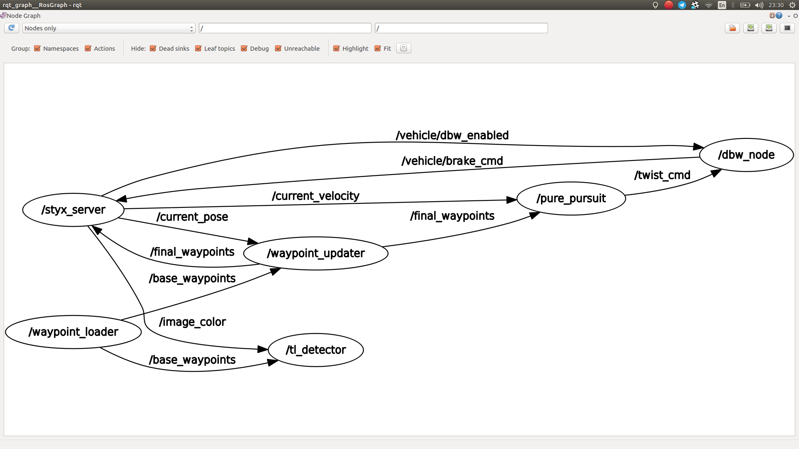

# Team Omnibot

**Udacity Self-Driving Car Nanodegree: Programming a Real Self-Driving Car.**

This is the **system integration** project repo of Team Omnibot programming a real self-driving car. Boilerplate code and instructions from [Udacity: CarND-Capstone](https://github.com/udacity/CarND-Capstone). Team members are from July 2017 cohort accomplishing the final term 3 project due May 21st, 2018. 

## Project Team

|Name|Github|Contribution|Email
|---|---|---|--- 
|Henrique Nery (TL)|[@nery_henrique](https://github.com/nery_henrique)|Waypointer|nery.henrique@gmail.com
|Shane Dominic|[@sdshdomi](https://github.com/sdshdomi)|DBW Node|shane.dominic@toyota-motorsport.com
|Davinder Chandhok|[@davinderc](https://github.com/davinderc)|Classifier|davinder.sc1@gmail.com
|Keith Lee| [@TonyLee33063](https://github.com/TonyLee33063)|Detector|lixiaoma218@126.com
|Chalid Mannaa|[@tochalid](https://github.com/tochalid)|Integration|tochalid@gmail.com

## Project Goal
The goal is to implement different ROS nodes for core functionality of the autonomous drive-by-wire (dbw) vehicle system, including traffic light detection, control, and waypoint following, and run the code on Udacity self driving car ["Carla"](https://medium.com/udacity/how-the-udacity-self-driving-car-works-575365270a40). The code will be tested on [simulator](https://github.com/udacity/CarND-Capstone/releases) first, then on Carla. The key features are:

* Detection of traffic lights colours - RED, YELLOW, GREEN
* Stopping car on RED, moving on GREEN, ignore YELLOW
* Following waypoints sending the control command on drive-by-wire, for throttle, brake, and steering

## Solution


The system architecture consists of **Perception, Planning and Control** nodes that communicate via function calls. All code base can be found in the source folder `(path_to_project_repo)/ros/src/` and improvements where made to following files:

- `tl_detector/tl_detector.py`
- `tl_detector/light_classification_model/tl_classfier.py`
- `waypointer_updater/waypoint_updater.py`
- `twist_controller/dbw_node.py`
- `twist_controller/twist_controller.py`

### Traffic Light Detection Node


This node takes in data from the `/image_color, /current_pose, and /base_waypoints` topics and publishes the locations to stop for red traffic lights to the `/traffic_waypoint` topic. The `/current_pose` topic provides the vehicle's current position, and `/base_waypoints` provides a complete list of waypoints the car will be following.

### Waypoint Updater Node


The purpose of this node is to update the target velocity property of each waypoint based on traffic light and obstacle detection data. This node will subscribe to the `/base_waypoints, /current_pose, /obstacle_waypoint, and /traffic_waypoint` topics, and publish a list of waypoints ahead of the car with target velocities to the `/final_waypoints` topic.

### DBW Node


The `dbw_node` subscribes to the `/current_velocity` topic along with the `/twist_cmd` topic to receive target linear and angular velocities. Additionally, this node will subscribe to `/vehicle/dbw_enabled`, which indicates if the car is under dbw or driver control. This node will publish throttle, brake, and steering commands to the `/vehicle/throttle_cmd, /vehicle/brake_cmd, and /vehicle/steering_cmd` topics.

### Team approach

Node Interaction Diagram using ROS Framework Features



The team followed the implementation approach suggested by Udacity:

1. **Waypoint Updater Node (Partial)**: Complete a partial waypoint updater which subscribes to `/base_waypoints` and `/current_pose` and publishes to `/final_waypoints`.
2. **DBW Node**: Once your waypoint updater is publishing `/final_waypoints`, the `waypoint_follower` node will start publishing messages to the `/twist_cmd` topic. At this point, you have everything needed to build the `dbw_node`. After completing this step, the car should drive in the simulator, ignoring the traffic lights.
3. **Traffic Light Detection**: This can be split into 2 parts:
* *Detection*: Detect the traffic light and its color from the `/image_color`. The topic `/vehicle/traffic_lights` contains the exact location and status of all traffic lights in simulator, so you can test your output.
* *Waypoint publishing*: Once you have correctly identified the traffic light and determined its position, you can convert it to a waypoint index and publish it.
4. **Waypoint Updater (Full)**: Use `/traffic_waypoint` to change the waypoint target velocities before publishing to `/final_waypoints`. Your car should now stop at red traffic lights and move when they are green.

## Testing

The system is tested in the simulator and after deployed to a car. The real-world testing provides ROS bag information that can be analyzed offline for optimizatin purpose.

### Usage with Simulator

1. Clone the project repository
```bash
git clone https://github.com/udacity/CarND-Capstone.git
```

2. Install python dependencies
```bash
cd CarND-Capstone
pip install -r requirements.txt
```
3. Make and run styx
```bash
cd ros
catkin_make
source devel/setup.sh
roslaunch launch/styx.launch
```
4. Run the simulator

### Simulator Test Requirements

Following requirements must be fulfilled in the simulator.

1. The `launch/styx.launch` and `launch/site.launch` files are used to test code in the simulator and on the vehicle respectively.
2. Smoothly follow waypoints in the simulator.
3. Respect the target top speed set for the waypoints' `twist.twist.linear.x` in `waypoint_loader.py`. The vehicle adheres to the kph target top speed set in `waypoint_loader/launch/waypoint_loader`.launch.
4. Stop at traffic lights when needed.
5. Stop and restart PID controllers depending on the state of /vehicle/dbw_enabled.
6. Publish throttle, steering, and brake commands at 50hz.

### Simulator Test Results
There are two findings for further optimization:

* The performance of the traffic light detector FCN is relevant for the overall performance of the vehicle to master the test course. A compute intensive FCN (Perception) impacts the other components (Planning, Controller) -> design least complex model with highest accuracy, depending on available HW make a balanced trade-off
* The isolated controller component seems sufficient but the PID can be improved. -> test and optimize the 3 throttle params Kp=.5, Ki=.005, Kd=.0 in [twist_controller.py](./ros/src/twist_controller/twist_controller.py) depending on waypointer implementation and available HW

This video shows 7min the **ref test ride** with setting the light.state from simulator in file [tl_detector.py -> get_light_state](./ros/src/tl_detector/tl_detector.py).

[Reference Video](./vids/vokoscreen-2018-05-26_10-21-36_light.state.mkv)

This video shows 7min test ride using a [**simpler FCN**](./ros/src/tl_detector/light_classification/model/inf_graph_sim.pb) to classify traffic light state.

[Model 1 Video](.vids/vokoscreen-2018-05-26_10-40-32_graph_sim.mkv)

This video shows 7min test ride using a [**more complex FCN**](ros/src/tl_detector/light_classification/model/inf_graph_sim_new.pb) to classify traffic light state.

[Model 2 Video](.vids/vokoscreen-2018-05-26_10-40-32_graph_sim_new.mkv)

### Real world testing

1. Download [training bag](https://s3-us-west-1.amazonaws.com/udacity-selfdrivingcar/traffic_light_bag_file.zip) that was recorded on the Udacity self-driving car.
2. Unzip the file
```bash
unzip traffic_light_bag_file.zip
```
3. Play the bag file
```bash
rosbag play -l traffic_light_bag_file/traffic_light_training.bag
```
4. Launch your project in site mode
```bash
cd CarND-Capstone/ros
roslaunch launch/site.launch
```
5. Confirm that traffic light detection works on real life images

### Using ROS Bag Feedback for Optimization

To replay the ROS bag, use the following steps:

* Download the [rviz config file](https://s3-us-west-1.amazonaws.com/udacity-selfdrivingcar/default.rviz).
* Open a terminal and start `roscore`.
* Open another terminal, run `rosbag play -l <path_to_your.bag>`
* Open one more terminal and run `rviz`. You can change the RViz configuration to the Udacity download by navigating to your config file from `File > Open Config` in RViz. Alternatively, if you'd like to make the Udacity config file your default, you can replace the rviz config file found in `~/.rviz/default.rviz`.

## Further Used References

* [Traffic Light Detection and Classification](https://medium.com/@UdacityINDIA/self-driving-vehicles-traffic-light-detection-and-classification-with-tensorflow-object-detection-d6a4d25e99c2)
* [Tensorflow Object Detection](https://github.com/tensorflow/models/tree/master/research/object_detection/g3doc)
* [Github Commands](https://help.github.com/articles/adding-a-file-to-a-repository-using-the-command-line/)
* [ROS Bags](http://wiki.ros.org/Bags)
* [Udacity Introduction Video](https://classroom.udacity.com/nanodegrees/nd013/parts/6047fe34-d93c-4f50-8336-b70ef10cb4b2/modules/e1a23b06-329a-4684-a717-ad476f0d8dff/lessons/462c933d-9f24-42d3-8bdc-a08a5fc866e4/concepts/5ab4b122-83e6-436d-850f-9f4d26627fd9)

##  Environment 

Please use **one** of the two installation options, either native **or** docker installation.

### Native Installation

* Be sure that your workstation is running Ubuntu 16.04 Xenial Xerus or Ubuntu 14.04 Trusty Tahir. [Ubuntu downloads can be found here](https://www.ubuntu.com/download/desktop).
* If using a Virtual Machine to install Ubuntu, use the following configuration as minimum:
  * 2 CPU
  * 2 GB system memory
  * 25 GB of free hard drive space

  The Udacity provided virtual machine has ROS and Dataspeed DBW already installed, so you can skip the next two steps if you are using this.

* Follow these instructions to install ROS
  * [ROS Kinetic](http://wiki.ros.org/kinetic/Installation/Ubuntu) if you have Ubuntu 16.04.
  * [ROS Indigo](http://wiki.ros.org/indigo/Installation/Ubuntu) if you have Ubuntu 14.04.
* [Dataspeed DBW](https://bitbucket.org/DataspeedInc/dbw_mkz_ros)
  * Use this option to install the SDK on a workstation that already has ROS installed: [One Line SDK Install (binary)](https://bitbucket.org/DataspeedInc/dbw_mkz_ros/src/81e63fcc335d7b64139d7482017d6a97b405e250/ROS_SETUP.md?fileviewer=file-view-default)
* Download the [Udacity Simulator](https://github.com/udacity/CarND-Capstone/releases).

### Docker Installation
[Install Docker](https://docs.docker.com/engine/installation/)

Build the docker container
```bash
docker build . -t capstone
```

Run the docker file
```bash
docker run -p 4567:4567 -v $PWD:/capstone -v /tmp/log:/root/.ros/ --rm -it capstone
```

### Port Forwarding
To set up port forwarding, please refer to the [instructions from term 2](https://classroom.udacity.com/nanodegrees/nd013/parts/40f38239-66b6-46ec-ae68-03afd8a601c8/modules/0949fca6-b379-42af-a919-ee50aa304e6a/lessons/f758c44c-5e40-4e01-93b5-1a82aa4e044f/concepts/16cf4a78-4fc7-49e1-8621-3450ca938b77)